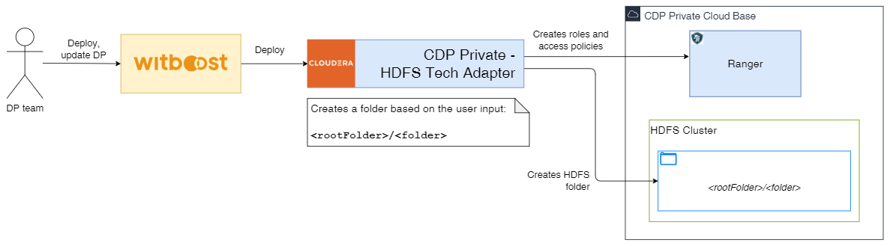

Use this template to create an HDFS Storage that creates an HDFS directory, granting access to the data product owners

### Prerequisites

A Data Product should already exist in order to attach the new components to it.

### Component Metadata

This section includes the basic information that any Component of Witboost must have:

- Name: Required name used for display purposes on your Data Product
- Description: A short description to help others understand what this Storage Area is for.
- Domain: The Domain of the Data Product this Storage Area belongs to. Be sure to choose it correctly as is a fundamental part of the Storage Area and cannot be changed afterwards.
- Data Product: The Data Product this Storage Area belongs to, be sure to choose the right one.
- Identifier: Unique ID for this new entity inside the domain. Don't worry to fill this field, it will be automatically filled for you.
- Development Group: Development group of this Data Product. Don't worry to fill this field, it will be automatically filled for you.
- Depends On: If you want your Storage Area to depend on other components from the Data Product, you can choose this option (Optional).

*Example:*

| Field name              | Example value                                                                                          |
|:------------------------|:-------------------------------------------------------------------------------------------------------|
| **Name**                | HDFS Vaccinations Storage                                                                              |
| **Description**         | Creates the vaccinations schema for this Data Product                                                  |
| **Domain**              | domain:healthcare                                                                                      |
| **Data Product**        | system:healthcare.vaccinationsdp.0                                                                     |
| ***Identifier***        | Will look something like this: *healthcare.vaccinationsdp.0.hdfs-vaccinations-storage*                 |
| ***Development Group*** | Might look something like this: *group:datameshplatform* Depends on the Data Product development group |

### Provide HDFS deployment information

This section includes the necessary information to build the folder hierarchy inside HDFS. It allows the user to write a custom prefix path to a folder where the hierarchy will be created. 

- Prefix Path: Required prefix path defaulting to the root `/` path. It must start and end with `/`. The folder created by this component will be located in: `{{ prefixPath }}/data-products/{{ domainName }}/{{ dataProductName }}/{{ dataProductMajorVersion }}/{{ componentName }}`. All the names are normalized replacing spaces and underscores with hyphens (`-`).

*Example:*

| Field name      | Example value |
|:----------------|:--------------|
| **Prefix Path** | /witboost/    |

After this step, the system will show you the summary of the information provided. You can go back and edit them if you notice any mistake, otherwise you can go ahead and create the Component.

After clicking on **"Create"**, the Component registration will start. If no errors occur, it will go through the 3 phases (Fetching, Publishing and Registering) and it will show you the links to the newly created repository inside GitLab and the new Data Product Component in the Builder Catalog.
